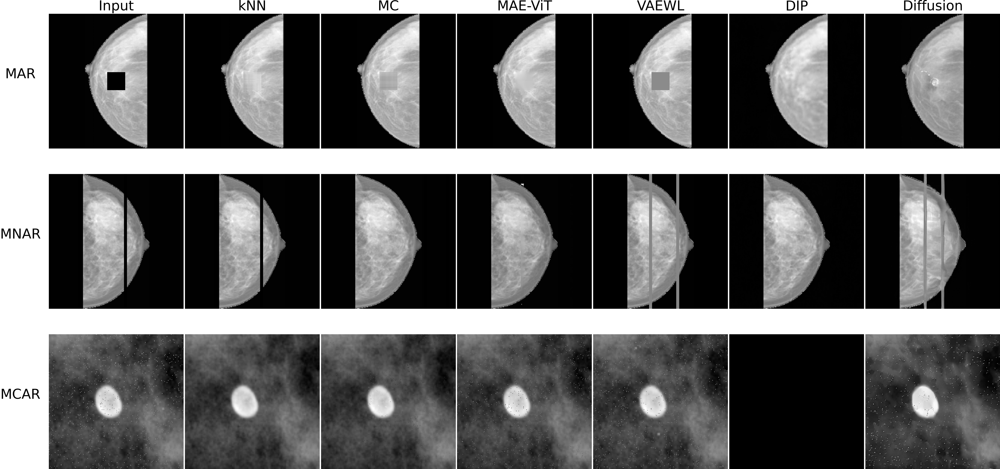

# Robustness Evaluation of Image Inpainting Techniques

This repository provides the codebase for evaluating six image inpainting methods—**Median, k-Nearest Neighbors (kNN), Matrix Completion, Variational Autoencoder with Weighted Loss (VAE-WL), Masked Autoencoder Vision Transformer (MAE-ViT), and Masked Autoencoder Vision Transformer with GAN Loss (MAE-ViT+GAN)**—across three mammography datasets: INBreast, MIAS, and a stratified 1,000-image subset of VinDr-Mammo.

An example of inpainted images produced by the evaluated methods is shown below:

<p align="center">
  
</p>

The results reported in this repository are described in a paper submitted to the 28th International Conference on Pattern Recognition (ICPR 2026), to be held in Lyon, France. Additionally, the supplementary material can be viewed [here](paper)

## Getting Started

We recommend creating a **virtual environment** before running the experiments:

```bash
python -m venv env
source env/bin/activate  # On Linux/macOS
.\env\Scripts\activate   # On Windows
```

To install the required dependencies, run:
```bash 
pip install -r requirements.txt
```

## Acknowledgments

This study was financed, in part, by the São Paulo Research Foundation (FAPESP), Brasil. Process Numbers 2021/06870-3 and 2024/23791-8. This work was also financed through national funds by FCT - Fundação para a Ciência e a Tecnologia, I.P., in the framework of the Project UIDB/00326/2025 and UIDP/00326/2025. Additionally, it was supported by the Portuguese Recovery and Resilience Plan (PRR) through project C645008882-00000055-Center for Responsable AI.
