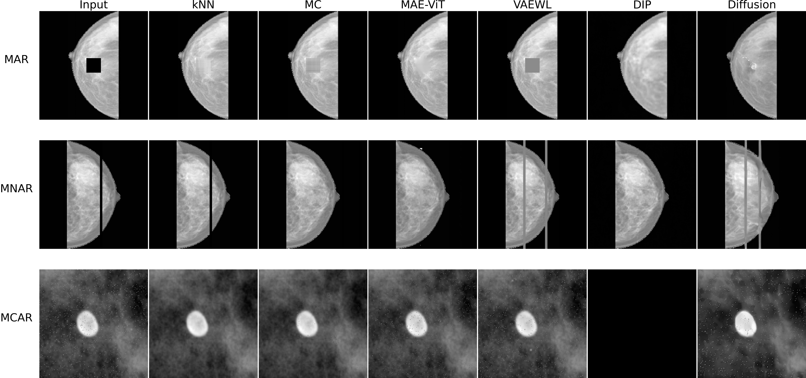

# Robustness Evaluation of Image Inpainting Techniques

This repository provides the codebase for evaluating six image inpainting methods—**$\kappa$-Nearest Neighbors (kNN), Matrix Completion, Variational Autoencoder with Weighted Loss (VAE-WL), Masked Autoencoder Vision Transformer (MAE-ViT), Deep Image Prior (DIP), and MAM-E: Mammographic synthetic image generation with diffusion models **—across mammography datasets: INBreast, MIAS, CBIS-DDSM, and a stratified 1,000-image subset of VinDr-Mammo.

An example of inpainted images produced by the evaluated methods is shown below:

<p align="center">
  
</p>

The results reported in this repository are described in a paper submitted to the British Machine Vision Conference, to be held in UK. Additionally, the supplementary material can be viewed [here](paper)

## Getting Started

We recommend creating a **virtual environment** before running the experiments:

```bash
python -m venv env
source env/bin/activate  # On Linux/macOS
.\env\Scripts\activate   # On Windows
```

To install the required dependencies, run:
```bash 
pip install -r requirements.txt
pip install flask
```

## 🔬 Reproducing the Experiments

To reproduce the results reported in the paper, run the following scripts according to each missingness mechanism:


To reproduce the findings from paper, you must run:
```bash
python codes/experimental_design_dead_pixels.py   # MCAR
python codes/experimental_random_square.py        # MAR
python codes/experimental_design_stripes.py       # MNAR
```
After running all experiments, aggregate the results with:
```bash
codes/aux_codes.py 
```

## 🧠 MedInpainter: Open-Source Framework for Mammography Inpainting

To promote reproducibility and support further research in mechanism-aware image inpainting, we introduce MedInpainter, an open-source framework designed for mammographic imaging.

The framework provides:
- Mapping to missingness mechanisms (MCAR, MAR, MNAR)
- Standardized and reproducible evaluation protocols
- Benchmarking support for inpainting methods 

Run the application with:
```bash 
python app.py
```

## Contributing

Contributions are welcome!
If you find this project useful, consider giving it a ⭐ on GitHub.

## Citation
```bash
To be updated soon.
```

## Acknowledgments

This study was financed, in part, by the São Paulo Research Foundation (FAPESP), Brasil. Process Numbers 2021/06870-3 and 2024/23791-8. This work was also financed through national funds by FCT - Fundação para a Ciência e a Tecnologia, I.P., in the framework of the Project UIDB/00326/2025 and UIDP/00326/2025. Additionally, it was supported by the Portuguese Recovery and Resilience Plan (PRR) through project C645008882-00000055-Center for Responsable AI.
