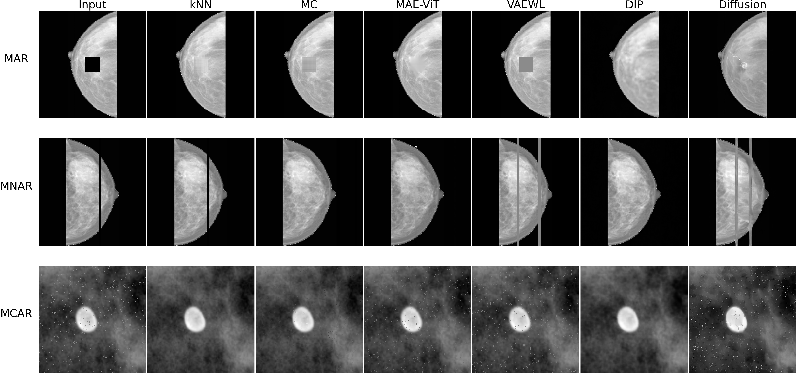
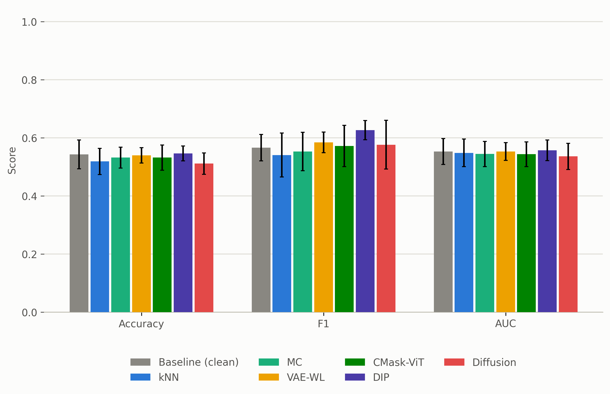
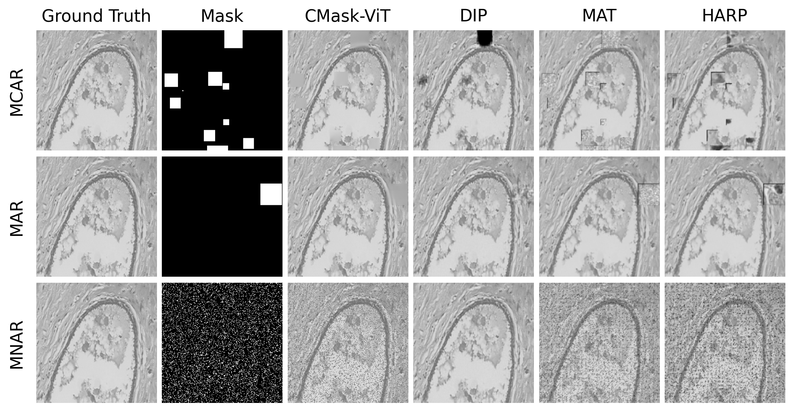
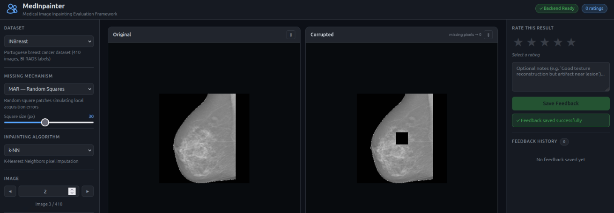

# Robustness Evaluation of Image Inpainting Techniques

This repository provides the codebase for evaluating image inpainting methods—**$\kappa$-Nearest Neighbors (kNN), Matrix Completion (MC), Variational Autoencoder with Weighted Loss (VAE-WL), CMask-ViT (a Masked Autoencoder Vision Transformer), Deep Image Prior (DIP), and MAM-E: Mammographic synthetic image generation with diffusion models**—across mammography datasets: INBreast, MIAS, CBIS-DDSM, and a stratified 1,000-image subset of VinDr-Mammo. Two additional methods, **MAT** and **HARP**, are included in a generalization study to a histopathology dataset (BreaKHis).

The results reported in this repository are described in a paper submitted to the British Machine Vision Conference, to be held in UK. Additionally, the supplementary material can be viewed [here](paper).

## Qualitative Results

Example of inpainted images produced by the evaluated methods, across the three missingness mechanisms (MAR, MNAR, MCAR):

<p align="center">
  
</p>

## Downstream Impact on Classification

Beyond pixel-level reconstruction quality, we measure how each inpainting method affects a downstream VGG16 classification task (Accuracy, F1, AUC) compared to a clean, non-corrupted baseline:

<p align="center">
  
</p>

## Generalization to Histopathology (BreaKHis)

To test whether the evaluated methods generalize beyond mammography, we repeat the inpainting evaluation on the BreaKHis histopathology dataset, additionally benchmarking **MAT** and **HARP**:

<p align="center">
  
</p>

## Getting Started

We recommend creating a **virtual environment** before running the experiments:

```bash
python -m venv env
source env/bin/activate  # On Linux/macOS
.\env\Scripts\activate   # On Windows
```

To install the required dependencies, run:
```bash
pip install -r requirements.txt
pip install flask
```

## 🔬 Reproducing the Experiments

To reproduce the results reported in the paper, run the following scripts according to each missingness mechanism:

```bash
python codes/experimental_design_dead_pixels.py   # MCAR
python codes/experimental_design_random_square.py # MAR
python codes/experimental_design_stripes.py       # MNAR
```

To reproduce the histopathology generalization study (BreaKHis):
```bash
python codes/experimental_design_breakhist.py
```

To reproduce the downstream classification impact analysis:
```bash
python codes/classification_vgg16.py
```

After running all experiments, aggregate the results with:
```bash
python codes/aux_codes.py
```

## 🧠 MedInpainter: Open-Source Framework for Mammography Inpainting

To promote reproducibility and support further research in mechanism-aware image inpainting, we introduce MedInpainter, an open-source, browser-based framework designed for mammographic imaging.

<p align="center">
  
</p>

The framework provides:
- Mapping to missingness mechanisms (MCAR, MAR, MNAR)
- Standardized and reproducible evaluation protocols
- Benchmarking support for inpainting methods
- Human-in-the-loop feedback collection for qualitative assessment

### Running MedInpainter

Launch the application with:
```bash
python app.py
```
It starts a local Flask server at **http://127.0.0.1:5000/** — open that address in your browser. Note that `app.py` runs Flask's development server (`debug=True`); it is intended for local/research use, not production deployment.

### Using the interface

1. **Choose a dataset** from the sidebar: INBreast, MIAS, CBIS-DDSM, or VinDr-Mammo. (If a dataset isn't available locally, MedInpainter falls back to a synthetic mammogram-like image in "Demo Mode".)
2. **Choose a missingness mechanism** and tune its parameters with the sliders:
   - MCAR — Dead Pixels (single-pixel and cluster dropout probabilities, cluster size)
   - MAR — Random Squares (square size)
   - MNAR — Column Stripes (fraction of corrupted columns, stripe width)
   - MNAR — Saturation Dropout (alpha, threshold)
3. **Choose an inpainting algorithm**: kNN, Matrix Completion, VAE-WL, CMask-ViT (MAE-ViT), DIP, or Diffusion.
4. **Select an image** using the index field or the previous/next arrows, then click **Generate**.
5. Inspect the result grid — Original, Corrupted, Binary Mask, and Imputed image — along with PSNR, SSIM, MAE, and missing-pixel percentage. Each image card can be downloaded individually.
6. **Rate the result** (1–5 stars, with optional notes) and click **Save Feedback**. Saved entries appear in the Feedback History panel and can be exported as a CSV file for later analysis.

## Contributing

Contributions are welcome!
If you find this project useful, consider giving it a ⭐ on GitHub.

## Citation

```bibtex
% Citation will be provided as soon as possible.
```

## License

This project is licensed under the MIT License — see the [LICENSE](LICENSE) file for details.

## Acknowledgments

This study was financed, in part, by the São Paulo Research Foundation (FAPESP), Brasil. Process Numbers 2021/06870-3 and 2024/23791-8. This work was also financed through national funds by FCT - Fundação para a Ciência e a Tecnologia, I.P., in the framework of the Project UIDB/00326/2025 and UIDP/00326/2025. Additionally, it was supported by the Portuguese Recovery and Resilience Plan (PRR) through project C645008882-00000055-Center for Responsable AI.
